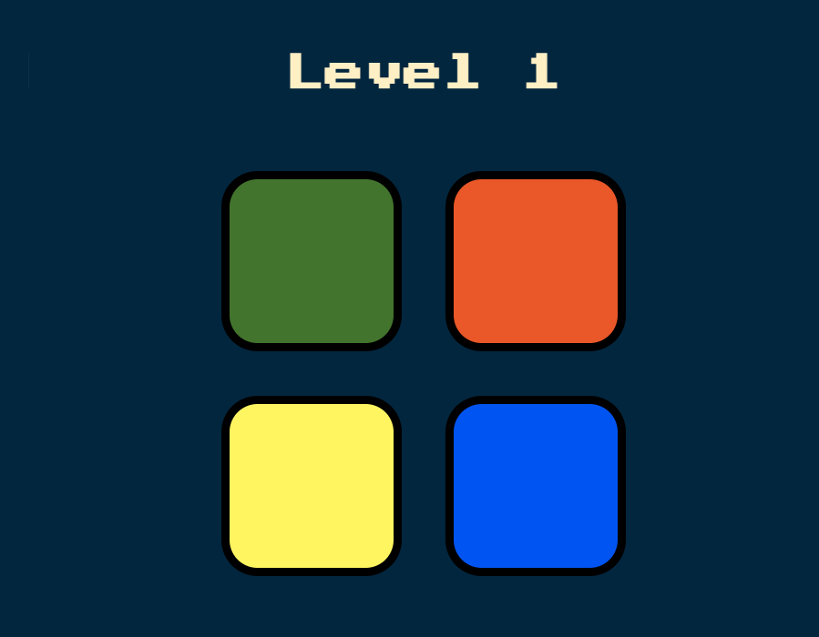

# 🟢 Simon Game 🎮

A fun memory-based color sequence game built using **HTML**, **CSS**, **JavaScript**, and **jQuery**.

> Press a key to start — repeat the pattern — how far can you go?

---

## 📸 Preview



---

## 🚀 Features

- 🔀 Randomly generated color sequences  
- 🖱️ Click to play, 🎹 Keyboard to start  
- 🔊 Sound and visual effects  
- 💥 Instant restart on wrong click  
- 🧠 Increasing difficulty per level  

---

## 🧰 Technologies Used

- HTML5  
- CSS3  
- JavaScript (ES6)  
- jQuery  
- Google Fonts  

---

## 📂 Folder Structure

```

Simon-Game/
├── index.html        # Main HTML file
├── styles.css        # Game styling
├── game.js           # Game logic
├── sounds/           # Button sound files
│   ├── red.mp3
│   ├── blue.mp3
│   ├── green.mp3
│   └── yellow\.mp3
└── README.md         # You're here!

````

---

## 🎮 How to Play

1. Open the game in your browser.  
2. Press any key to start.  
3. A color will flash — click the same color.  
4. Memorize and repeat the growing pattern.  
5. Game ends if you click the wrong color.  

---

## 🛠️ Setup & Usage

Clone the repo and open the game locally:

```bash
git clone https://github.com/bikram8538/Simon-Game.git
cd Simon-Game
````

Then open `index.html` in your browser, or use Live Server in VS Code.

---

## 🔊 Sound Troubleshooting

* Ensure the `sounds/` folder is present and `.mp3` files are named correctly.
* Some browsers block audio autoplay — interact first (click or keypress).
* Use a supported browser like **Chrome**, **Firefox**, or **Edge**.

---

## 🧱 Future Ideas

* Add touch support for mobile devices
* High score tracking with `localStorage`
* Leaderboard integration
* Theme switch (dark/light)

---

## 📜 License

This project is open-source under the [MIT License](LICENSE).

---

## 👤 Author

**Bikram Bagdi**
[GitHub Profile](https://github.com/bikram8538)

```

---
